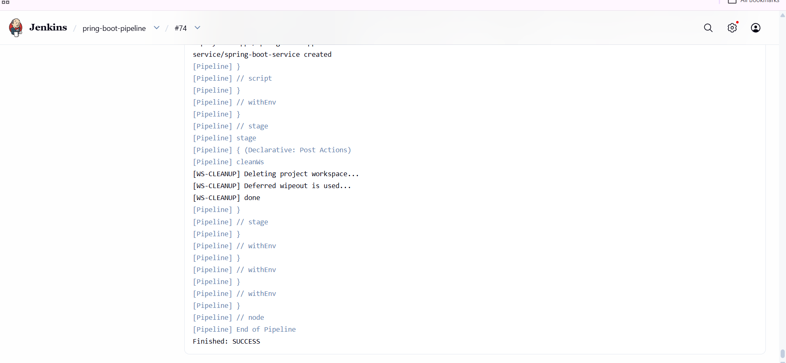
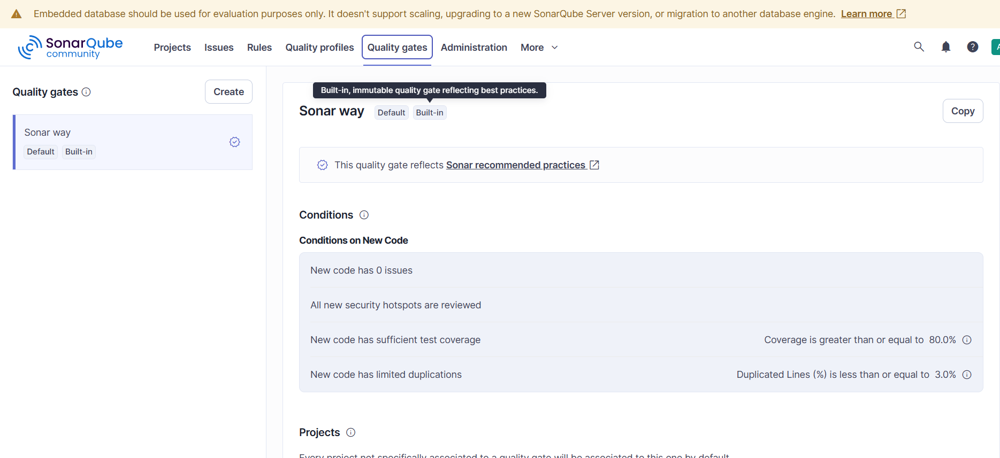
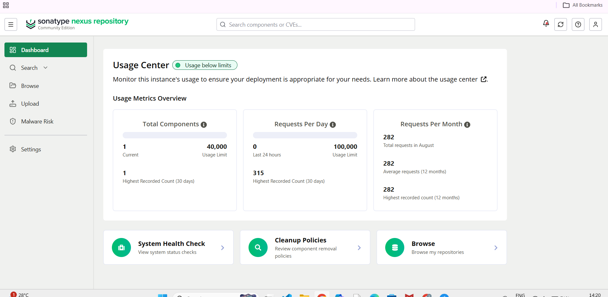
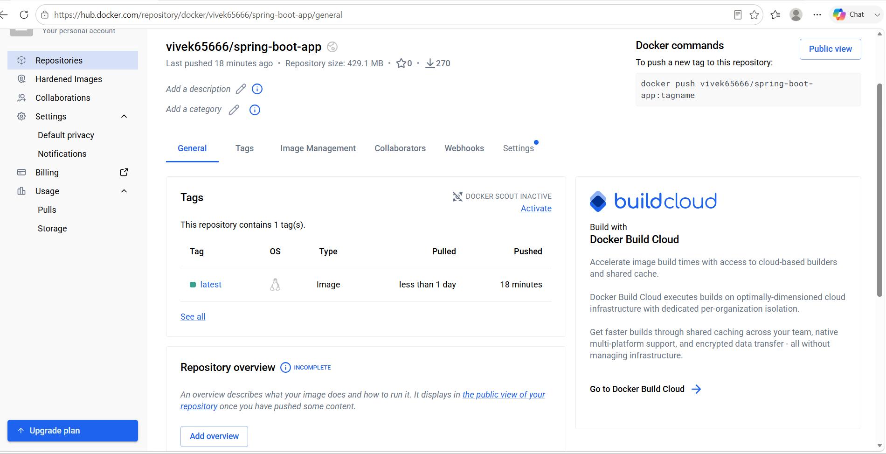
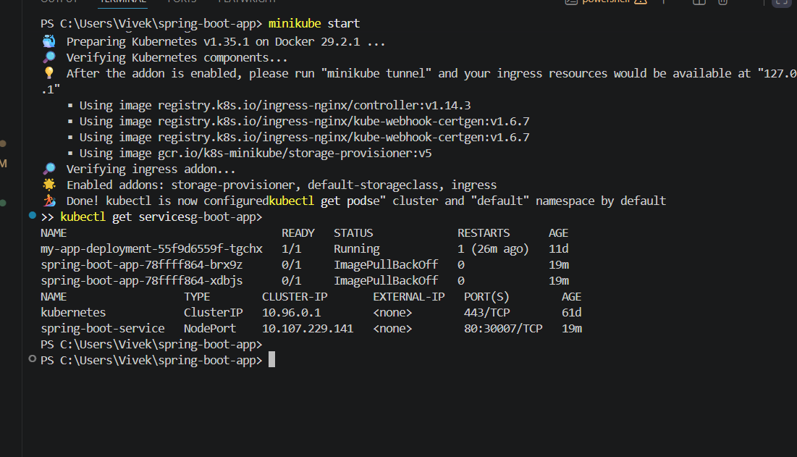
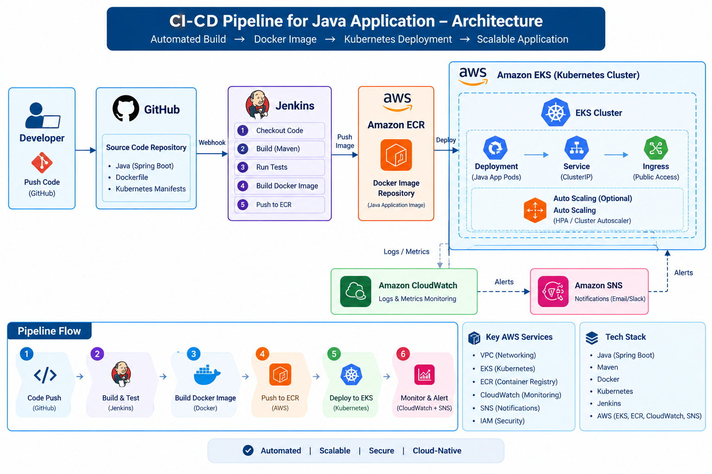

# CI/CD Pipeline for Java Application 🚀

An end-to-end automated Continuous Integration and Continuous Deployment (CI/CD) pipeline built for a Java Spring Boot application, leveraging industry-standard DevOps tools.

## 🛠️ Tech Stack & Tools

* **Version Control:** Git & GitHub
* **CI/CD Orchestrator:** Jenkins (Declarative Pipeline)
* **Build Tool:** Apache Maven
* **Code Quality Analysis:** SonarQube
* **Artifact Repository:** Sonatype Nexus
* **Containerization:** Docker & Docker Hub
* **Orchestration & Deployment:** Kubernetes (Minikube)
* **Application Framework:** Spring Boot (Java 17)

---

## 🏗️ Pipeline Architecture

The pipeline executes the following **6 sequential stages** on every code push:

1. **Checkout Code:** Pulls the latest source code from the main GitHub branch.
2. **Build & Unit Test:** Compiles the project and runs unit tests using Maven (`mvn clean test`).
3. **Code Quality Analysis:** Performs static code analysis using **SonarQube** to check for code health.
4. **Publish Artifact to Nexus:** Packages the application and deploys the release artifact to **Sonatype Nexus**.
5. **Build & Push Docker Image:** Builds an optimized Docker image of the Spring Boot application and pushes it to **Docker Hub**.
6. **Deploy to Kubernetes:** Dynamically updates the Kubernetes deployment manifest with the build tag and deploys the application directly into a local **Minikube** cluster using `kubectl`.

---

## 📷 Pipeline Execution & Proof of Success

### 1. Jenkins Successful Build (`Finished: SUCCESS`)
The automated pipeline running through Jenkins, successfully clearing all stages including workspace cleanup and Kubernetes deployment.


### 2. SonarQube Code Quality Analysis
Static code analysis profile configured with best-practice quality gates (`Sonar way`).


### 3. Sonatype Nexus Repository Dashboard
Artifact management tracking deployed components and repository health.


### 4. Docker Hub Repository Tags
Public container registry repository showing the successfully pushed image tags.


### 5. Kubernetes Pods & Services
Minikube terminal output confirming the deployment and active services running inside the cluster.


### 📐 AWS CI/CD Architecture



> AWS-based CI/CD architecture illustrating the flow from GitHub and Jenkins through container image management and Kubernetes deployment, with monitoring and notifications.

---

## 📂 Project Structure

```text
├── .vscode/               # Workspace configurations
├── k8s/                   # Kubernetes deployment and service manifests
│   └── deployment.yaml
├── Screenshots/           # Pipeline execution visual proof
├── src/                   # Spring Boot application source code
├── Dockerfile             # Container configuration for the Spring Boot app
├── Jenkinsfile            # Jenkins Declarative Pipeline definition
└── pom.xml                # Maven project configuration
